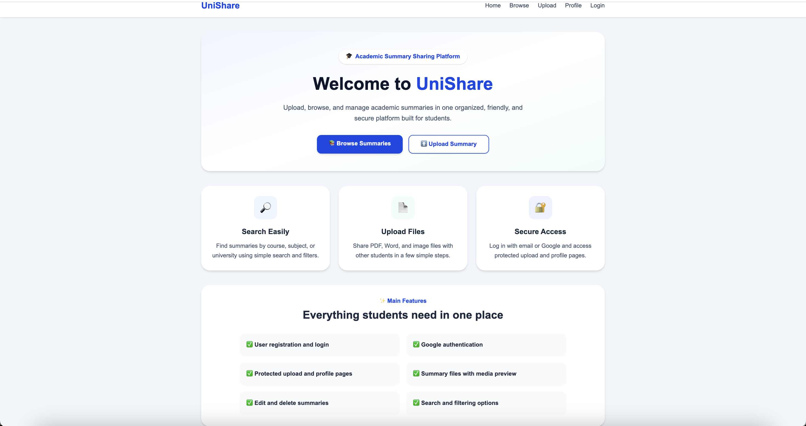
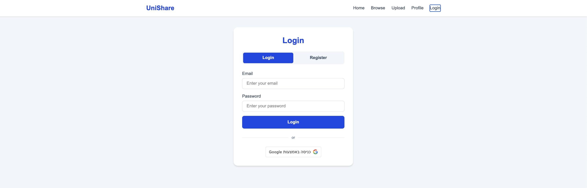
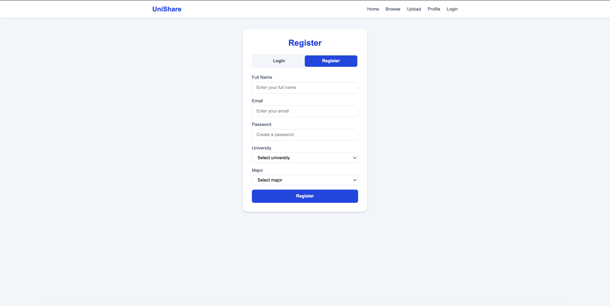
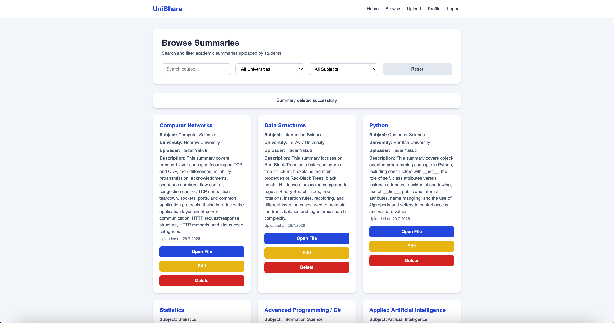
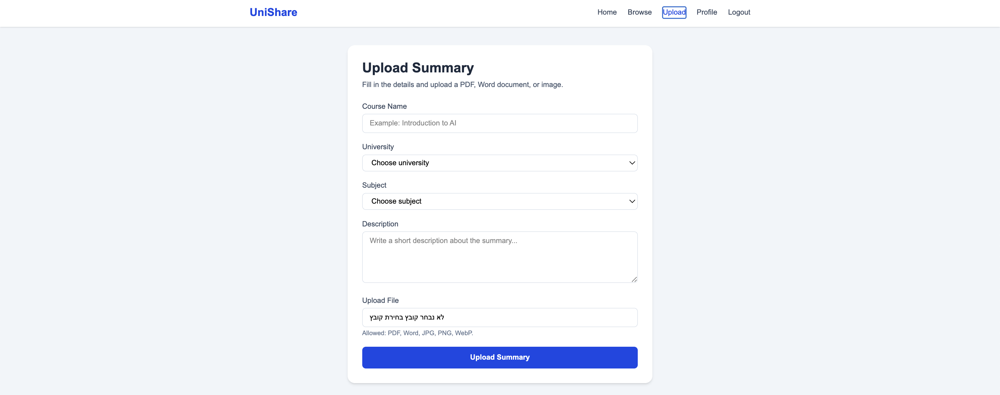
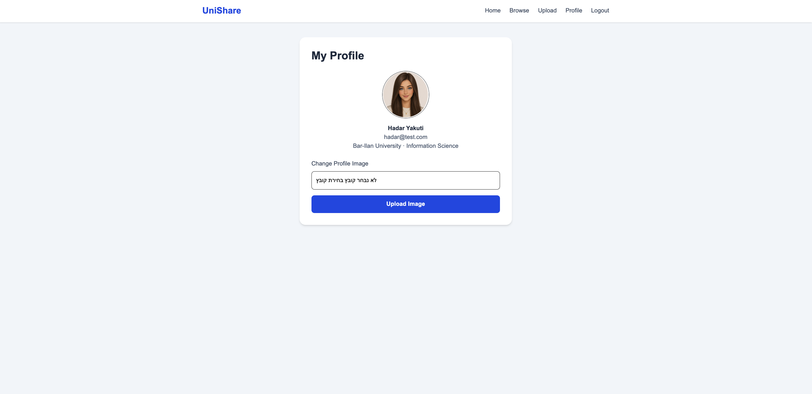
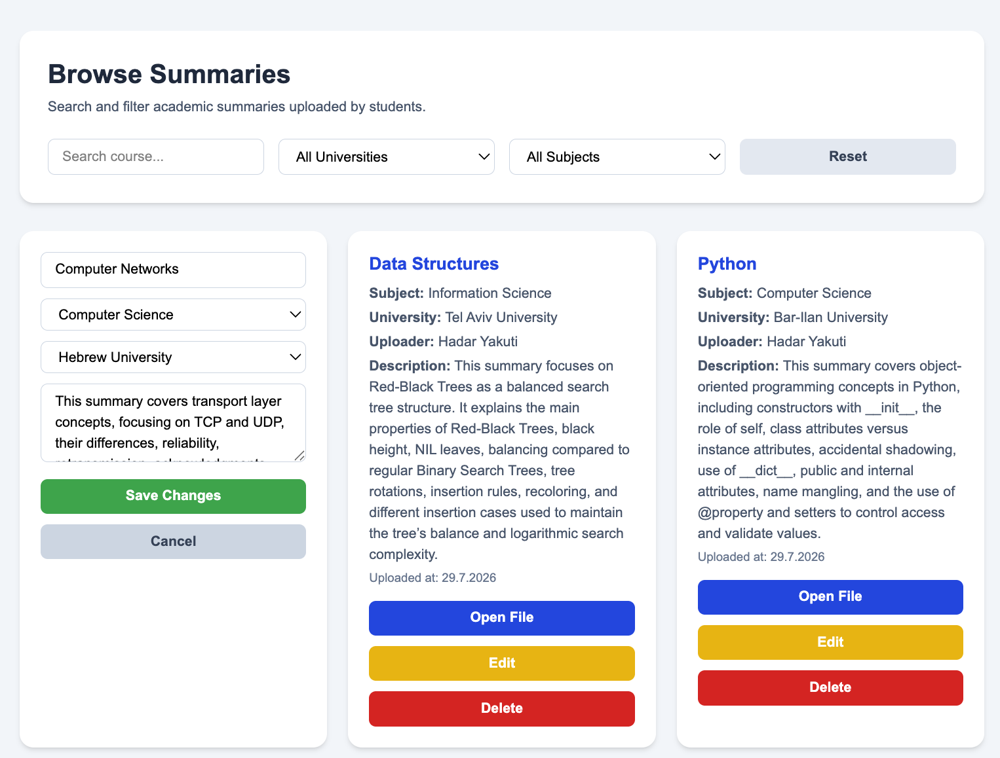
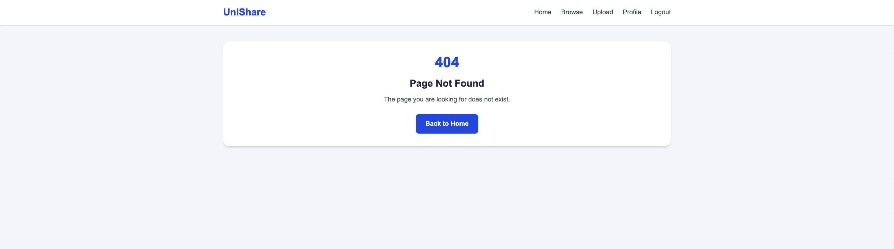

# UniShare

## Live Demo

Frontend: https://uni-share-mu.vercel.app  
Backend: https://unishare-server-1vdq.onrender.com

UniShare is a full stack academic summary sharing platform for students.

The system allows users to register, log in, upload academic summaries, browse shared summaries, edit and delete summaries, and manage their personal profile.

Uploaded summary files and profile images are handled with Multer and stored in MongoDB.

## Features

- User registration and login
- Google Login authentication
- JWT-based authentication
- Protected routes
- Upload academic summaries with files
- Store uploaded files in MongoDB
- Browse summaries
- Search and filter summaries
- Edit and delete summaries
- Profile page
- Profile image upload
- Dynamic media display for uploaded files
- Loading and error states
- 404 Not Found page

## Tech Stack

### Frontend

- React
- TypeScript
- Vite
- React Router
- Axios
- Context API
- Redux Toolkit
- Tailwind CSS
- Google OAuth

### Backend

- Node.js
- Express.js
- MongoDB
- Mongoose
- JWT
- bcryptjs
- JOI validation
- Multer
- Google Auth Library
- Helmet
- Express Rate Limit

## Project Structure

```text
UniShare/
├── client/
│   ├── src/
│   │   ├── components/
│   │   ├── context/
│   │   ├── hooks/
│   │   ├── pages/
│   │   ├── services/
│   │   └── store/
│   ├── .env.example
│   └── package.json
│
├── Server/
│   ├── config/
│   ├── controllers/
│   ├── middleware/
│   ├── models/
│   ├── routes/
│   ├── uploads/
│   ├── validation/
│   ├── .env.example
│   ├── app.js
│   ├── server.js
│   └── package.json
│
├── screenshots/
├── README.md
└── .gitignore
```

## Environment Variables

### Server

Create a `.env` file inside the `Server` folder:

```env
NODE_ENV=development
PORT=5000
MONGO_URI=your_mongodb_connection_string_here
JWT_SECRET=your_jwt_secret_here
JWT_EXPIRES_IN=1h
CLIENT_URL=http://localhost:5173
GOOGLE_CLIENT_ID=your_google_client_id
```

### Client

Create a `.env` file inside the `client` folder:

```env
VITE_API_URL=http://127.0.0.1:5000/api
VITE_GOOGLE_CLIENT_ID=your_google_client_id
```

## Installation and Setup

### Server

Go to the Server folder:

```bash
cd Server
```

Install dependencies:

```bash
npm install
```

Run the server:

```bash
npm start
```

The server runs locally on:

```text
http://127.0.0.1:5000
```

### Client

Go to the client folder:

```bash
cd client
```

Install dependencies:

```bash
npm install
```

Run the client:

```bash
npm run dev
```

The client runs locally on:

```text
http://localhost:5173
```

Build the client:

```bash
npm run build
```

## API Endpoints

### Auth Routes

| Method | Endpoint | Description | Protected |
|---|---|---|---|
| POST | `/api/auth/register` | Register a new user | No |
| POST | `/api/auth/login` | Login user | No |
| POST | `/api/auth/google` | Login with Google | No |
| GET | `/api/auth/me` | Get current user profile | Yes |
| PUT | `/api/auth/profile-image` | Upload profile image to MongoDB | Yes |
| GET | `/api/auth/profile-image/:id` | Get profile image from MongoDB | No |

### Summary Routes

| Method | Endpoint | Description | Protected |
|---|---|---|---|
| GET | `/api/summaries` | Get all summaries | No |
| GET | `/api/summaries/:id` | Get summary by ID | No |
| GET | `/api/summaries/:id/file` | Get uploaded summary file from MongoDB | No |
| POST | `/api/summaries` | Create a new summary with file upload | Yes |
| PUT | `/api/summaries/:id` | Update summary | Yes |
| DELETE | `/api/summaries/:id` | Delete summary | Yes |

## Main Pages

- Home page
- Login / Register page
- Browse summaries page
- Upload summary page
- Profile page
- 404 Not Found page

## Screenshots

### Home



### Login



### Register



### Browse Summaries



### Upload Summary



### Profile



### Edit Summary



### 404 Not Found



## Deployment

The frontend is deployed on Vercel.  
The backend is deployed on Render.  
The database is hosted on MongoDB Atlas.

## Author

Hadar Yakuti